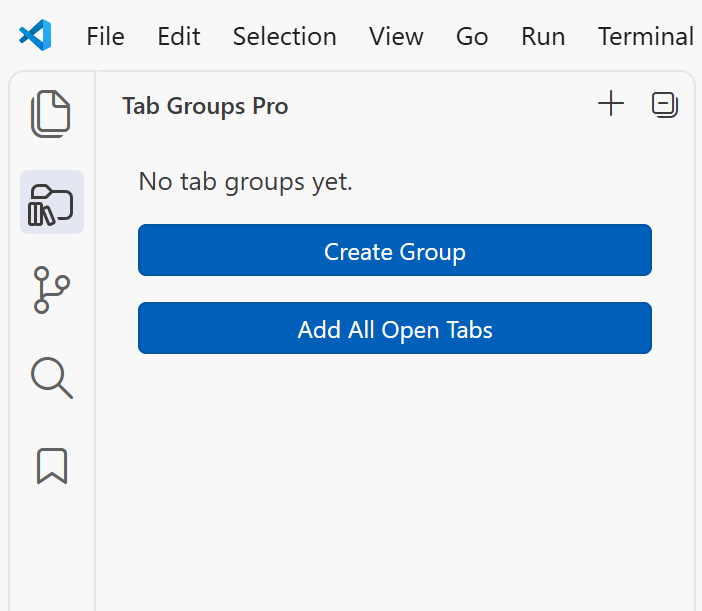
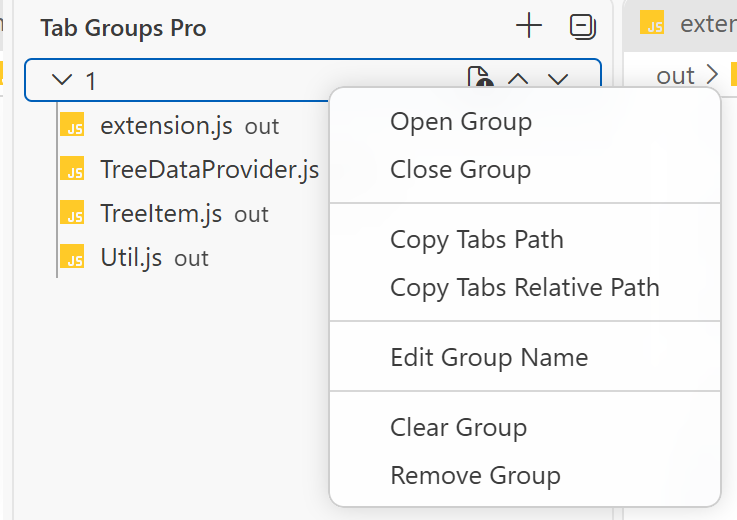

# Tab Groups Pro

简体中文 | [English](README.md)

为每个 VS Code 工作区创建可持久保存的文件分组，并按确定的顺序重新打开所需文件。

## 功能

- 创建、重命名、排序、清空和删除文件分组。
- 将当前文件或全部已打开的文本标签添加到分组。
- 按保存顺序打开或关闭分组中的全部文件。
- 按工作区保存分组数据及展开、折叠状态。
- 单击预览文件，通过 **Open Tab** 或双击固定文件。
- 显示文件主题图标、文件名、相对目录、完整路径提示和分组文件数量。
- 复制分组中全部文件的绝对路径或工作区相对路径。
- 在已展开的分组中跟随当前活动编辑器。
- 添加文件时自动排除会造成重复的文件和分组。

## 功能预览

### 创建第一个分组

### 管理分组文件

## 快速开始

1. 在 VS Code 中打开文件夹或工作区。
2. 从活动栏打开 **Tab Groups Pro**。
3. 执行 **Tab Groups Pro: Add a New Group**，或使用 **Add All Opened Tabs to Group**。
4. 通过分组右侧按钮或右键菜单添加、排序、打开、关闭、复制、清空或删除条目。

分组保存在 VS Code 的工作区状态中，再次打开同一工作区时会自动恢复。

## 配置

| 配置项 | 默认值 | 说明 |
| --- | --- | --- |
| `tab-groups-pro.closeTabsOnOpenGroup` | `false` | 打开分组前关闭当前所有编辑器标签。 |
| `tab-groups-pro.closeTabsOnAddAllToGroup` | `false` | 将全部文本标签加入分组后关闭这些标签。 |

## 使用限制

- 文件必须属于当前打开的 VS Code 工作区。
- **Add All Opened Tabs to Group** 只会添加文本文件标签。
- 分组数据按工作区保存，本扩展不会在不同设备间同步数据。
- 当前目录来自已安装扩展，包含打包后的 JavaScript 运行时代码，但不包含原始 TypeScript 源码树。开始长期维护前请阅读 [PUBLISHING.zh-CN.md](PUBLISHING.zh-CN.md)。

## 更新日志

参见 [CHANGELOG.zh-CN.md](CHANGELOG.zh-CN.md)。

## 致谢

本项目基于 [bentodaniel](https://github.com/bentodaniel/vs-tab-groups) 的原始工作。发布派生版本前，应保留原作者署名并确认代码的再分发许可。

## 许可证与来源说明

Shelus2021 原创的新增内容和修改部分采用 MIT 许可证。由于准备此版本时未在上游 VS Tab Groups 项目中找到许可证，源自上游的部分仍受其各自权利人的权利约束。

准确的许可范围见 [LICENSE](LICENSE) 和 [NOTICE.zh-CN.md](NOTICE.zh-CN.md)。如认为本项目侵犯了你的权利，请联系 [shelus2021@foxmail.com](mailto:shelus2021@foxmail.com)。
